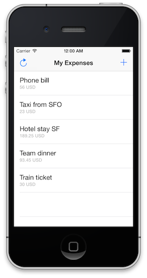

# Podio Expenses

*Podio Expenses* is an iPhone app for reporting expense built using [PodioKit](https://github.com/podio/podio-objc), the Podio Objective-C library. It is meant to demonstrate the functionality of PodioKit and serve as a reference implementation.

 

## Run the app

Before you can run the app, you need to setup your own API key and secret as well as the Podio app to use as a backend for the iOS app.

### 1. Generate a Podio API key and secret
To generate a Podio API key and secret, use [this guide](https://developers.podio.com/api-key).

### 2. Create the backend Podio app
Now you need to create a [Podio app](https://developers.podio.com/doc/applications) to use as the backend for this iOS app. Go to your Podio account on on the web and create a new app called *Expenses* in any workspace. This app will contain all expenses created from the iOS app in the form of Podio [items](https://developers.podio.com/doc/items).

Add two fields to the app:

* A **Text** field called *Title*
* A **Money** field called *Amount*
* An **Image** field called *Receipt*

Each expense created will need to provide a value for each of these fields.

Once your app is created, find out its app ID by clicking the small wrench icon to the top right of your app and selecting the "Developer" option in the drop down menu.

### 3. Build and run
This project uses [CocoaPods](http://cocoapods.org/) to install 3rd party dependencies, including PodioKit. In order to run it, you need to first have CocoaPods installed and then run the following command from the project root directory:

```shell
$ pod install
```

Finally, you need to update the [PEConfig.h](PodioExpenses/PEConfig.h) file in the project with your API key, secret and app ID.

That's it. You should now be able to build and run the app on a device or simulator.

## Credits

This project uses a few open source components through CocoaPods:

* [**FXKeychain**](https://github.com/nicklockwood/FXKeychain) An easy to use Keychain wrapper.
* [**SVProgressHUD**](https://github.com/samvermette/SVProgressHUD) A convenient Progress HUD implementation.